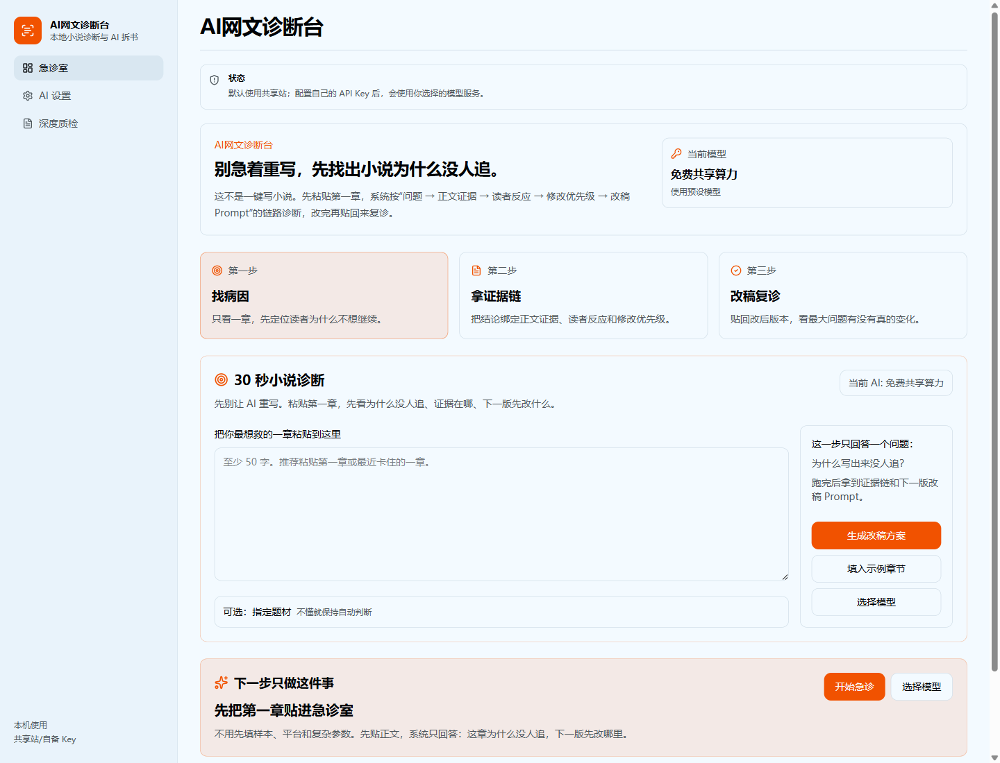
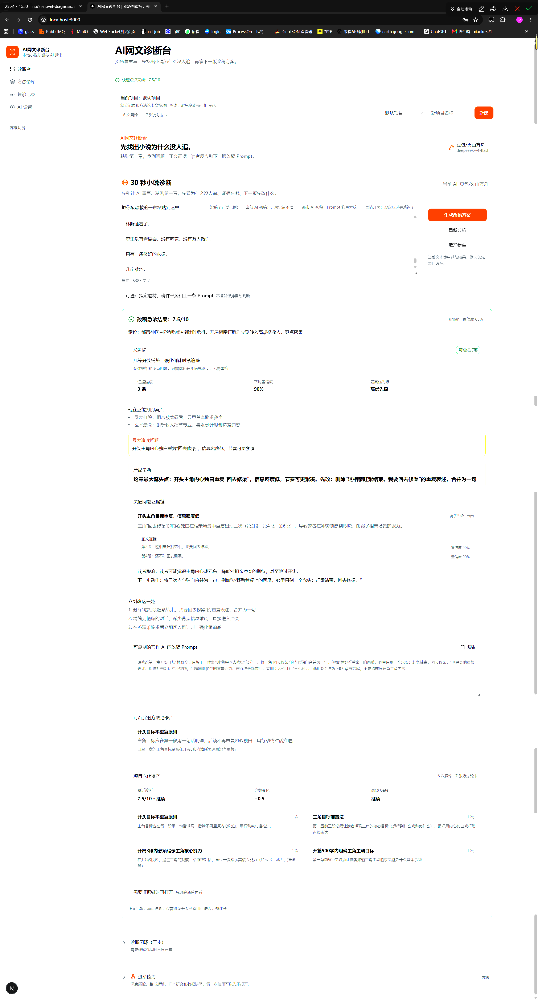

# AI网文诊断台

[简体中文](./README.md) | [English](./README.en.md)

[](https://github.com/myyimu/ai-novel-diagnosis/actions/workflows/ci.yml)
[](./LICENSE)

别急着让 AI 重写，先诊断这稿为什么没人追。

AI网文诊断台是本地 AI 小说诊断、改稿复诊与 Prompt 迭代工具。它不是一键写小说工具，而是帮作者回答：这篇稿子哪里不好，为什么没有流量，读者为什么第一章就走？

功能覆盖：AI Novel Diagnosis Desk 是一站式 AI 网文诊断工作台，可自动解析小说文本，生成小说人物关系图谱，诊断读者流失原因，并输出可执行的智能改稿 Prompt。

粘贴第一章或 AI 生成初稿，它会定位最大流失点，用正文证据解释问题，给出修改优先级，并生成能直接复制给写作 AI 的改稿 Prompt。改完后再贴回来复诊，看问题是不是真的被解决。

进阶时，它还能做 AI 拆书：拆角色、关系、世界观、时间线和写作结构，帮你学习成熟作品怎么留住读者，而不是照搬内容。

> Alpha 阶段：当前适合本地试用、功能验证和收集反馈，不建议直接作为生产服务暴露到公网。

## 3 分钟试用

Windows 用户可以直接双击：

```text
scripts/start-local.cmd
```

脚本会检查 Node.js / pnpm、安装缺失依赖、启动 API 和 Web，并自动打开页面。进入页面后，先不用配置复杂参数，直接粘贴第一章运行“改稿急诊”。

终端用户也可以在仓库根目录运行：

```powershell
pnpm run start:local
```

默认地址：

```text
Web: http://127.0.0.1:3000
API: http://127.0.0.1:3001/api/v1
```

## 你会得到什么

- 一眼看到第一章最大的流失点：开头、卖点、情绪、节奏、设定表达或市场承诺。
- 一份小说诊断解释：把“为什么没流量、为什么没人追读”拆成可修改的文本问题。
- 一份可复制的改稿 Prompt：不是泛泛点评，而是能交给写作 AI 继续改的任务说明。
- 一次复诊对比：改稿前后重新跑，判断这次修改有没有真正解决问题。
- 一批可沉淀的方法论卡片：把反复出现的问题变成自查规则和 Prompt 规则。
- 一套进阶学习资产：成熟样本 Rubric、拆书阅读报告、理解版思维导图、关键关系故事线、关系图谱和导出包。

## 示例诊断报告

应用内已经内置玄幻、都市、言情三个示例章节。本地演示模式下，选择示例并点击“生成改稿方案”，会直接看到对应的结构化诊断报告。

可以先看这三份 Markdown 示例：

- [玄幻 AI 初稿开局承诺不清](./docs/examples/xuanhuan-diagnosis-report.md)
- [都市 AI 初稿 Prompt 约束太泛](./docs/examples/urban-diagnosis-report.md)
- [言情开局设定压过关系钩子](./docs/examples/romance-diagnosis-report.md)

## 为什么不用一键写小说工具内置评审

一键写小说工具更擅长“继续生成文本”。AI网文诊断台更关注“为什么写出来没人追”。

| 一键写小说工具 | AI网文诊断台 |
| --- | --- |
| 目标是生成更多正文 | 目标是找出为什么留不住读者 |
| 审稿常给泛泛建议 | 诊断绑定正文证据 |
| 容易直接替你重写 | 先解释病因，再给改稿 Prompt |
| 改前改后难对比 | 支持复诊闭环 |
| 偏单次输出 | 沉淀复诊记录、方法论卡片、Rubric 和进阶资产 |

一句话区别：

```text
一键写小说帮你写更多；AI网文诊断台帮你看清楚，为什么写出来没人追。
```

## 它怎么判断小说哪里不好

它不应该只给分，也不要求你盲信 AI。诊断报告会围绕同一条证据链组织：

```text
问题 -> 正文证据 -> 读者反应 -> 修改优先级 -> 改稿 Prompt -> 复诊检查点
```

后续诊断结果会继续向结构化 issue 和 Gate 判断升级：

```text
issue -> severity -> category -> evidence -> reader impact -> fix action -> gate decision
```

Gate 只表示当前稿件的改稿优先级建议，例如继续、修改、重构或废稿；它不是平台流量预测。

它重点检查：

- 第一章哪里劝退。
- 标题/简介承诺和正文体验是否断裂。
- 主角目标、压力、损失和选择是否足够具体。
- 爽点、冲突、情绪回报是否来得太晚。
- 设定是否挡住了剧情。
- 有点击却没追读时，文本是否浪费了这次点击。

它不预测平台算法，只诊断文本有没有浪费你的点击。

## AI 拆书是不是抄书

不是。AI 拆书不是帮你照搬原作，而是把成熟作品拆成结构经验：

- 人物功能。
- 冲突节奏。
- 世界观组织。
- 关系演化。
- 时间线。
- 可学习结构。
- “不要照搬”清单。

核心原则是：学结构，不搬内容。

## 产品截图



首页诊断台支持直接粘贴第一章，选择模型后生成可复诊的改稿报告：



报告会把“为什么没人追”拆成可执行的改稿任务：

- 显示快速评分、题材定位、置信度、Gate 判断和最大流失问题。
- 绑定正文证据，解释读者可能在哪里失去期待。
- 给出立即可改的三步动作，而不是只给泛泛评价。
- 生成可复制给写作 AI 的改稿 Prompt。
- 把反复出现的问题沉淀为项目方法论卡片，方便下一次写作前自查。

_界面仍在快速迭代中，请以当前版本实际页面为准。_

## 目录

- [3 分钟试用](#3-分钟试用)
- [你会得到什么](#你会得到什么)
- [示例诊断报告](#示例诊断报告)
- [为什么不用一键写小说工具内置评审](#为什么不用一键写小说工具内置评审)
- [它怎么判断小说哪里不好](#它怎么判断小说哪里不好)
- [AI 拆书是不是抄书](#ai-拆书是不是抄书)
- [适合谁](#适合谁)
- [典型使用路径](#典型使用路径)
- [主要能力](#主要能力)
- [技术栈](#技术栈)
- [支持的模型接入](#支持的模型接入)
- [本地启动](#本地启动)
- [工作区结构](#工作区结构)
- [本地数据](#本地数据)
- [Docker Compose 部署](#docker-compose-部署)
- [质量检查](#质量检查)
- [当前限制](#当前限制)
- [友情链接](#友情链接)
- [开源信息](#开源信息)
- [推荐 GitHub 主题标签](#推荐-github-主题标签)
- [One CLI 常用命令](#one-cli-常用命令)

## 适合谁

适合：

- 刚写完第一章，但不确定读者为什么会弃文的网文新手。
- 用 AI 生成了初稿，但不知道为什么读起来平、假、没钩子的作者。
- 想知道自己的小说哪里不好、为什么没流量、为什么没有追读的作者。
- 想把 AI 点评变成可执行改稿任务，而不是只得到“节奏慢、描写弱”的作者。
- 想把反复出现的问题沉淀成个人写作方法论和 Prompt 规则的作者。
- 想学习成熟样本怎么兑现题材承诺、人物关系和爽点节奏的作者。
- 想把整本 TXT 拆成角色卡、世界书、关系图谱、时间线和写作资产的作者。

不适合：

- 想让 AI 直接代写整本书。
- 想把拆解结果当作对原作的复制素材。
- 想要多人在线协作、账号权限和生产级托管服务。

## 典型使用路径

新手建议先走最短闭环：

```text
粘贴第一章 -> 运行改稿急诊 -> 查看最大流失点 -> 复制改稿 Prompt -> 改完再复诊
```

如果稿子来自 AI，可以额外补上上一条 Prompt：

```text
粘贴 AI 初稿 + 上一条 Prompt -> 诊断正文问题和 Prompt 缺口 -> 生成下一轮改稿 Prompt -> 改完复诊
```

当你需要更细的判断时，再进入高级质检：

```text
导入成熟参考章节 -> AI 识别市场定位 -> 生成评分标准 -> 按同一标准评分自己的章节
```

当你已经有完整 TXT 或多个样本时，再进入整书拆解：

```text
上传整本 TXT -> 切章预览 -> Map-Reduce 拆解 -> 拆书导览 -> 关系故事线 -> 图谱复核 -> 导出阅读报告/写作资产
```

当前页面入口已经收敛：`/` 是第一章诊断台，`/dashboard` 是诊断看板，`/methodology` 是方法论库，`/revisions` 是复诊历史，`/critique` 是深度质检，`/book` 是拆书图谱，`/library` 是样本研究，`/history` 是历史任务，`/export` 是导出资产，`/model` 是 AI 设置。`/workspace`、`/starter` 保留为兼容路由，会回到首页。

## 主要能力

第一章改稿急诊：

- 只粘贴自己的第一章，就能得到定位、卖点、最大流失点、三条改法和改稿 Prompt。
- 改完后可以再次复诊，对比 quickScore 和问题变化。
- 不强迫先填平台画像、成熟样本或复杂参数。

AI 生成稿诊断与 Prompt 迭代：

- 支持把 AI 初稿和上一条 Prompt 一起纳入诊断，判断问题来自正文执行、结构承诺还是 Prompt 约束不足。
- 诊断结果会逐步升级为结构化 issue，绑定证据、读者影响、改稿动作和 Prompt 约束。
- 诊断看板会展示常见问题、复诊改善趋势、Gate 分布和 Prompt 有效率归因，并给出编辑建议、项目级归因校准、置信度、诊断理由、信号、待补数据和可复制的模型/编辑复核提示。
- 示例诊断资产沉淀在 `fixtures/novel-diagnosis`，覆盖玄幻、都市和言情开局，可作为演示、回归测试和后续真实模型 golden 对照。

作者方法论沉淀：

- 把反复出现的问题沉淀成开头规则、节奏规则、爽点规则、Prompt 规则和反面清单。
- 方法论库不是历史任务列表，而是作者下次改稿前能复用的自查系统。
- 复诊历史和方法论库可导出当前项目 Markdown 包，沉淀编辑建议、人工备注、问题轨迹、Prompt 归因和可复用 Prompt 模板。

深度章节质检：

- 拆解成熟参考章节，识别分类、主题、标签、隐性期待和标题/简介承诺。
- 生成可迁移 Rubric，再用同一套标准评分自己的章节。
- 支持展现量、点击率、阅读 30s/60s、触底率、追更率等表现信号做归因辅助。

整书可视化拆解：

- 上传 TXT，清洗文本、预览章节切分，异步执行 Map-Reduce 拆书。
- 每章 map 完成后写入本地文件，token 不足或任务失败时不至于白跑。
- 先生成拆书导览、理解版思维导图、关键关系故事线和故事阶段时间轴，再进入完整角色、世界观、图谱和写作资产。

关系图谱工作台：

- 把整书拆解结果转成可点击图谱，支持总览、复核、时间线、节点拖拽和图谱导出；完整图谱是二次探索入口，不是第一眼入口。
- 对弱证据关系、孤立节点和疑似重复节点做确认、改标签、合并或忽略。
- 导出区按任务分成“先读懂”“继续创作”“资料归档/工具导入”，支持拆书阅读报告、完整学习报告、JSON、Tavern 角色卡、世界书、SillyTavern World Info、续写包、风格圣经、卷纲、提示词包和“不要照搬”清单。

## 技术栈

- 单仓多项目：One CLI
- 前端：Next.js
- 后端接口：NestJS
- 数据库：PostgreSQL，未配置时回退到 PGlite
- 包管理器：pnpm
- 模型接入：公共共享入口、自备 Key、OpenAI-compatible 接口

## 支持的模型接入

默认提供公共免费模型入口，也支持用户自带 Key；用户填写的 API Key 不持久化保存。

- mock：本地演示和自动化验证。
- AI Horde 公共模型池：默认入口，匿名低优先级队列，不需要用户填写 Key。
- OpenRouter 免费模型：服务端配置 OpenRouter Key，默认使用 `openrouter/free`，前端不要求用户填写 Key。
- 免费共享算力：由服务端配置 OpenAI-compatible 共享线路，前端不要求用户填写 Key。
- DeepSeek。
- 豆包 / 火山方舟。
- 阿里云百炼 / 通义千问。
- Ollama 本地模型。
- 自定义 OpenAI-compatible 接口。

## 本地启动

普通试用优先看上面的 [3 分钟试用](#3-分钟试用)。本节主要给开发者和需要调试启动参数的用户。

`scripts/start-local.cmd` 会先做环境检测，再进入启动流程：检查 Node.js / pnpm，缺依赖时会优先使用正常 pnpm 安装；如果当前盘符不支持依赖链接，会自动改用本地包复制 fallback；遇到普通损坏的 `node_modules` 会清理后重试一次；随后自动重启本项目已有 API / Web 服务，端口被其他服务占用时尝试附近端口，并把 API / Web 日志写入 `.local/run-logs`。

共享模型不可用或排队较久时，可以在页面的“AI 设置”切换自己的模型服务。

工程开发推荐使用 One CLI：

先安装依赖：

```bash
pnpm install
```

启动整个工作区：

```bash
pnpm run dev:dry-run
pnpm run dev
```

`pnpm run dev` 由 One CLI 接管，会按 `one.manifest.json` 中的项目定义启动 `web`、`api` 和 `ai-core`。

如果没有安装 One CLI，也可以使用 pnpm 原生命令启动：

```bash
pnpm run dev:raw
```

这会并行启动 `web`、`api` 和 `ai-core`，不依赖 `one` 命令。

Windows 本地一键启动脚本支持常用参数：

```powershell
scripts/start-local.cmd
scripts/start-local.cmd -a
pnpm run start:local -- -NoBrowser
pnpm run start:local -- -Reuse
pnpm run start:local -- -WebPort 3100 -ApiPort 3101
```

`scripts/start-local.cmd` 是最适合双击的新手入口；默认会重启本项目旧服务，不需要手动杀端口。`pnpm run start:local` 更适合开发者传递 `-NoBrowser`、`-Reuse`、`-WebPort`、`-ApiPort` 等 PowerShell 参数。脚本会打开两个 PowerShell 窗口，分别启动 `api` 和 `web`，并自动设置：

```text
Web: http://127.0.0.1:3000
API: http://127.0.0.1:3001/api/v1
NEXT_PUBLIC_API_BASE_URL=http://127.0.0.1:3001/api/v1
PGLITE_DATA_DIR=.local/pglite-runtime
```

关闭打开的 API / Web PowerShell 窗口即可停止服务。

单独启动某个项目，One CLI 版本：

```bash
pnpm run dev:web
pnpm run dev:api
pnpm run dev:core
```

单独启动某个项目，无 One CLI 版本：

```bash
pnpm run dev:web:raw
pnpm run dev:api:raw
pnpm run dev:core:raw
```

默认本地地址：

```text
Web: http://127.0.0.1:3000
API: http://127.0.0.1:3001/api/v1
```

### Windows 启动说明

- `scripts/start-local.cmd`
- `scripts/start-local.ps1`
- `pnpm run start:local`

这三个入口都会先做环境检查，再启动服务。本项目在 `.nvmrc` 和 `package.json#engines` 中声明了 Node.js 基线版本。如果本机缺少 Node.js 或版本过旧，脚本会优先尝试使用项目要求的版本；如果缺少 `pnpm`，会先尝试 `corepack`，再回退到 `npm install -g`。

通常安装后不需要重开终端，除非脚本明确提示当前 shell 仍然找不到 `node` 或 `pnpm`。更完整的双语启动说明见 [scripts/START-LOCAL-GUIDE.md](./scripts/START-LOCAL-GUIDE.md)。

## 工作区结构

- `apps/web`: Next.js 控制台，主路径为诊断台、深度质检、拆书图谱、样本研究、历史任务、导出资产和 AI 设置。
- `services/api`: NestJS API，负责文本清洗、章节切分、异步任务、整书拆解和导出。
- `packages/ai-core`: 共享类型、评分指标和分析契约。

## 本地数据

默认不配置 `DATABASE_URL` 时，API 会使用 `.local/pglite` 作为本地开发数据库。

上传 TXT 和整书拆解中间产物默认存放在 `.local/analysis`。这是本地开发明文存储，目录已被 `.gitignore` 忽略，不应提交上传文本、模型输出、本地数据库或 API Key。

如果处理真实作者稿件或商业稿件，可以设置 `ANALYSIS_STORAGE_KEY` 启用本地隐私模式。启用后，上传原文、标准化文本和上传快照会以 AES-256-GCM 写成 `.enc` 文件；API 会在读取时透明解密。请妥善保存这个密钥，丢失后已加密的本地上传无法恢复。

真实 PostgreSQL 部署使用 Drizzle migrations。初始迁移文件位于 `services/api/drizzle/migrations`；修改 `services/api/src/service/drizzle/schema.ts` 后，应执行：

```bash
pnpm --filter api db:generate
pnpm --filter api db:migrate
```

Docker Compose / One 容器启动时会先执行运行时迁移脚本，再启动 API。PGlite 仅作为本地开发兜底，不替代生产 PostgreSQL。

如果要启用“免费共享算力”入口，可以配置 OpenAI-compatible 共享线路：

```text
SHARED_GPU_BASE_URL=https://your-shared-gpu.example.com/v1
SHARED_GPU_MODEL=your-model-id
SHARED_GPU_API_KEY=optional-backend-only-key
SHARED_GPU_JSON_MODE=false
```

共享线路适合降低首次使用门槛，但可能排队、限流、超时、质量波动或不适合敏感文本；需要稳定性时建议在界面里切换到自备 Key 的付费模型。

## Docker Compose 部署

Docker Compose 适合已经安装 Docker Desktop 的本地部署或演示环境。普通作者用户更建议先使用 `scripts/start-local.cmd`。

复制根目录环境变量模板后启动：

```bash
cp .env.example .env
docker compose up --build
```

默认地址：

```text
Web: http://localhost:3000
API: http://localhost:3001/api/v1
健康检查: http://localhost:3001/health
```

当前 compose 只启动实际使用的 `postgres`、`api`、`web`。Redis / MinIO 暂未接入代码，不再默认启动。

上传文本和整书拆解中间结果默认保存在：

```text
.local/analysis
.local/artifacts
```

其中整书任务的章节 map 会写入：

```text
.local/artifacts/{jobId}/map-{chapterId}.json
```

`.local` 已被 `.gitignore` 忽略，不应提交上传文本、模型输出、本地数据库或 API Key。

## 质量检查

```bash
pnpm run one:doctor
pnpm run check
pnpm run test
pnpm run build
pnpm run ci
pnpm run container:prepare
pnpm run container:dry-run
pnpm run doctor
```

`check` 会运行各项目的 lint 和格式检查；格式检查只覆盖代码和配置文件，避免修改 One CLI 生成的 `CLAUDE.md` / `AGENTS.md`。

`container:prepare` 会先构建 web / api，再把 One CLI 项目目录 Docker context 需要的生产产物生成到 `.one-container`。该目录是临时产物，不提交。

`one:doctor` 会检查 One CLI workspace manifest、`one dev --dry-run`、Docker 容器目标、Kustomize 端口/env、`.one-container` 生产产物和部署 profile 状态。本地未配置 Kubernetes/kustomize 部署 profile 时会给出 warning，不会阻塞普通开发检查。

`doctor` 会运行完整 `ci`，然后执行 `container:prepare` 和 `one:doctor`。CI 的 workspace job 也使用这个入口。

## 当前限制

- 这是 Alpha / MVP，不保证 AI 拆解和评分完全准确。
- Gate、Prompt 有效率和复诊改善只能作为改稿优先级参考，不代表平台流量预测。
- 复诊历史、作者方法论库、诊断看板和项目导出包已接入后端持久化第一版；真实 PostgreSQL 部署已提供初始 Drizzle migration，后续 schema 变更需要生成新迁移。
- Prompt 归因已经抽到共享 `ai-core` 引擎并输出解释信号和项目级校准建议，但仍需要真实案例校准，不能替代编辑判断。
- 中间结果已经留存，失败或中断后的继续拆解已有基础入口；更细的半成品导出和跨会话复核持久化仍在迭代。
- 关系图谱支持本地人工修正和导出记录，但修正记录暂未做独立数据库持久化。
- 当前没有账号系统，更适合本地单人部署。
- 工具只提供拆解、学习、质检和导出能力；用户需要自行确认上传文本和导出素材的使用权与风险边界。

## 友情链接

- [linux.do](https://linux.do/)
- [One CLI](https://github.com/1cli-team/one-cli)
- [mediago-drama](https://github.com/mediago-dev/mediago-drama)

## 开源信息

- 开源协议：MIT，见 [LICENSE](./LICENSE)。
- 代码仓库：[github.com/myyimu/ai-novel-diagnosis](https://github.com/myyimu/ai-novel-diagnosis)
- 联系方式：[xiaoke5211@gmail.com](mailto:xiaoke5211@gmail.com)
- 产品定位与 AI 生成稿质检方向文档：见 [docs/product-positioning-ai-draft-diagnosis.md](./docs/product-positioning-ai-draft-diagnosis.md)。
- 诊断工作流化改造计划：见 [docs/diagnosis-workflow-implementation-plan.md](./docs/diagnosis-workflow-implementation-plan.md)。
- 产品评审与迭代规划：见 [docs/product-review-roadmap.md](./docs/product-review-roadmap.md)。
- 内容易懂性评审：见 [docs/content-clarity-review.md](./docs/content-clarity-review.md)。
- 拆书结果可理解性评审：见 [docs/book-disassembly-comprehension-review.md](./docs/book-disassembly-comprehension-review.md)。
- 贡献说明：见 [CONTRIBUTING.md](./CONTRIBUTING.md)
- 安全策略：见 [SECURITY.md](./SECURITY.md)
- GitHub 社交预览图候选稿：见 [docs/assets/github-social-preview.png](./docs/assets/github-social-preview.png)。

## 推荐 GitHub 主题标签

```text
ai-novel
ai
llm
artificial-intelligence
prompt-engineering
natural-language-processing
knowledge-graph
text-analysis
storytelling
webnovel
novel
novel-analysis
book-analysis
novel-diagnosis
webnovel-diagnosis
ai-writing
writing-assistant
relationship-graph
writing
writing-tools
```

## One CLI 常用命令

真实工作区状态由 `one.manifest.json` 定义。常用命令：

```bash
one dev --dry-run -o json
one container info -o json
one container build --dry-run -o json
```
