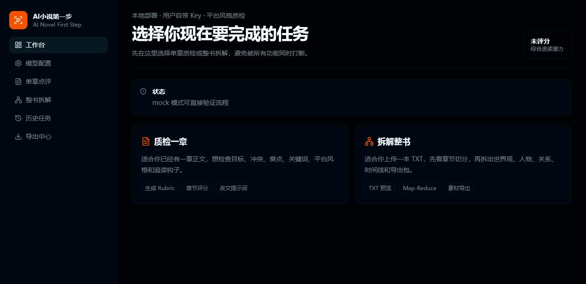

# AI小说第一步

[简体中文](./README.md) | [English](./README.en.md)

[](https://github.com/myyimu/ai-novel-first-step/actions/workflows/ci.yml)
[](./LICENSE)

本地部署的 AI 小说章节急诊与样本拆解工具。它不是代写工具，而是帮助网文新手先救自己的第一章：粘贴章节、找出最大追读问题、拿到可复制给写作 AI 的改稿 Prompt；需要更深入时，再导入成熟样本生成评分标准，做高级质检和整书拆解。

> Alpha 阶段：当前适合本地试用、功能验证和收集反馈，不建议直接作为生产服务暴露到公网。

## 产品截图



_界面仍在快速迭代中，截图仅供参考，请以当前版本实际页面为准。_

## 目录

- [适合解决什么问题](#适合解决什么问题)
- [推荐使用路径](#推荐使用路径)
- [主要功能](#主要功能)
- [技术栈](#技术栈)
- [支持的模型接入](#支持的模型接入)
- [本地启动](#本地启动)
- [Workspace](#workspace)
- [本地数据](#本地数据)
- [质量检查](#质量检查)
- [当前限制](#当前限制)
- [Friendly Links](#friendly-links)
- [开源信息](#开源信息)

## 适合解决什么问题

- 写完第一章后，不知道读者会在哪里流失。
- 不知道当前章节最大的问题是开头、卖点、情绪、节奏还是设定表达。
- 想把 AI 的建议变成可以直接复制使用的改稿 Prompt，而不是泛泛点评。
- 想进一步用成熟样本生成 Rubric，再用同一套标准质检自己的稿子。
- 想上传整本 TXT，拆出世界观、人物、故事线、大事纪和可导出的写作资产。

## 推荐使用路径

新手建议先走最短闭环：

```text
粘贴自己的章节 -> 运行章节急诊 -> 查看最大追读问题 -> 复制改稿 Prompt -> 改完再测一次
```

当你需要更细的判断时，再进入高级质检：

```text
导入成熟参考章节 -> AI 识别市场定位 -> 生成评分标准 -> 按同一标准评分自己的章节
```

整书资产和研究库适合进阶使用：当你已经有完整 TXT 或多个样本时，用它们沉淀角色卡、世界书、风格规则、选题判断和可追溯证据。

## 主要功能

- 章节急诊：只粘贴自己的章节，也能先得到定位、卖点、最大问题、改法和改稿 Prompt。
- 复测闭环：改稿前后可以对比快速点评结果，判断改动是否真的解决问题。
- 高级质检：拆解成熟参考章节，生成评分 Rubric，再按同一标准给自己的章节评分。
- 平台画像：支持目标平台、目标读者、阅读场景、分类、主题、标签和关键词。
- 数据辅助：支持展现量、点击率、阅读 30s/60s、触底率、追更率等表现归因。
- 整书拆解：上传 TXT，清洗文本、章节切分、异步 Map-Reduce 拆书。
- 中间结果留存：每章 map 完成后写入本地文件，token 不足或任务失败时不至于白跑。
- 导出中心：支持 Markdown、JSON、Tavern 角色卡、World Book、SillyTavern World Info、续写包、风格圣经、卷纲、提示词包和 Do Not Copy 清单。
- 原创化导出：可选择原作拆解笔记或抽象、去标识化后的原创化素材包。

## 技术栈

- Monorepo: One CLI
- Web: Next.js
- API: NestJS
- DB: PostgreSQL / PGlite fallback
- Package manager: pnpm
- Model provider: BYOK, OpenAI-compatible

## 支持的模型接入

默认提供公共免费模型入口，也支持用户自带 Key；用户填写的 API Key 不持久化保存。

- mock：本地演示和自动化验证。
- AI Horde 公共模型池：默认入口，匿名低优先级队列，不需要用户填写 Key。
- OpenRouter 免费模型：服务端配置 OpenRouter Key，默认使用 `openrouter/free`，前端不要求用户填写 Key。
- 免费共享算力：由服务端配置 OpenAI-compatible 共享线路，前端不要求用户填写 Key。
- DeepSeek。
- 豆包 / 火山方舟。
- 阿里云百炼 / 通义千问。
- Ollama 本地模型。
- 自定义 OpenAI-compatible 接口。

## 本地启动

如果只是想最快体验产品，Windows 用户优先使用一键启动：

```powershell
pnpm run start:local
```

启动后打开：

```text
Web: http://127.0.0.1:3000
```

进入页面后可以先不配置复杂参数，直接粘贴章节运行“章节急诊”。共享模型不可用或排队较久时，再到“AI 设置”切换自己的模型服务。

工程开发推荐使用 One CLI：

先安装依赖：

```bash
pnpm install
```

启动整个 workspace：

```bash
pnpm run dev:dry-run
pnpm run dev
```

`pnpm run dev` 由 One CLI 接管，会按 `one.manifest.json` 中的项目定义启动 `web`、`api` 和 `ai-core`。

如果没有安装 One CLI，也可以使用 pnpm 原生命令启动：

```bash
pnpm run dev:raw
```

这会并行启动 `web`、`api` 和 `ai-core`，不依赖 `one` 命令。

Windows 本地一键启动等价入口：

```powershell
pnpm run start:local
```

也可以直接双击：

```text
scripts/start-local.cmd
```

这个脚本会打开两个 PowerShell 窗口，分别启动 `api` 和 `web`，并自动设置：

```text
Web: http://127.0.0.1:3000
API: http://127.0.0.1:3001/api/v1
NEXT_PUBLIC_API_BASE_URL=http://127.0.0.1:3001/api/v1
```

关闭打开的 API / Web PowerShell 窗口即可停止服务。

单独启动某个项目，One CLI 版本：

```bash
pnpm run dev:web
pnpm run dev:api
pnpm run dev:core
```

单独启动某个项目，无 One CLI 版本：

```bash
pnpm run dev:web:raw
pnpm run dev:api:raw
pnpm run dev:core:raw
```

默认本地地址：

```text
Web: http://127.0.0.1:3000
API: http://127.0.0.1:3001/api/v1
```

### Windows Startup Notes

- `scripts/start-local.cmd`
- `scripts/start-local.ps1`
- `pnpm run start:local`

All three entry points now run the environment check before launching services.
This project now declares its Node.js baseline in `.nvmrc` and `package.json#engines`.
If `Node.js` is missing or too old, the script tries to use that project version first.
If `pnpm` is missing, the script tries `corepack` first and falls back to `npm install -g`.
You usually do not need to reopen the terminal after installation unless the script explicitly says the current shell still cannot find `node` or `pnpm`.
See `scripts/START-LOCAL-GUIDE.md` for the consolidated bilingual startup guide.

## Workspace

- `apps/web`: Next.js 控制台。
- `services/api`: NestJS API，负责文本清洗、章节切分、异步任务、整书拆解和导出。
- `packages/ai-core`: 共享类型、评分指标和分析契约。

## 本地数据

默认不配置 `DATABASE_URL` 时，API 会使用 `.local/pglite` 作为本地开发数据库。

如果要启用“免费共享算力”入口，可以配置 OpenAI-compatible 共享线路：

```text
SHARED_GPU_BASE_URL=https://your-shared-gpu.example.com/v1
SHARED_GPU_MODEL=your-model-id
SHARED_GPU_API_KEY=optional-backend-only-key
SHARED_GPU_JSON_MODE=false
```

共享线路适合降低首次使用门槛，但可能排队、限流、超时、质量波动或不适合敏感文本；需要稳定性时建议在界面里切换到自备 Key 的付费模型。

## Docker Compose

Docker Compose 适合已经安装 Docker Desktop 的本地部署或演示环境。普通作者用户更建议先使用 `pnpm run start:local`。

复制根目录环境变量模板后启动：

```bash
cp .env.example .env
docker compose up --build
```

默认地址：

```text
Web: http://localhost:3000
API: http://localhost:3001/api/v1
Health: http://localhost:3001/health
```

当前 compose 只启动实际使用的 `postgres`、`api`、`web`。Redis / MinIO 暂未接入代码，不再默认启动。

上传文本和整书拆解中间结果默认保存在：

```text
.local/analysis
.local/artifacts
```

其中整书任务的章节 map 会写入：

```text
.local/artifacts/{jobId}/map-{chapterId}.json
```

`.local` 已被 `.gitignore` 忽略，不应提交上传文本、模型输出、本地数据库或 API Key。

## 质量检查

```bash
pnpm run one:doctor
pnpm run check
pnpm run test
pnpm run build
pnpm run ci
pnpm run container:prepare
pnpm run container:dry-run
pnpm run doctor
```

`check` 会运行各项目的 lint 和格式检查；格式检查只覆盖代码和配置文件，避免修改 One CLI 生成的 `CLAUDE.md` / `AGENTS.md`。

`container:prepare` 会先构建 web / api，再把 One CLI 项目目录 Docker context 需要的生产产物生成到 `.one-container`。该目录是临时产物，不提交。

`one:doctor` 会检查 One CLI workspace manifest、`one dev --dry-run`、Docker 容器目标、Kustomize 端口/env、`.one-container` 生产产物和部署 profile 状态。本地未配置 Kubernetes/kustomize 部署 profile 时会给出 warning，不会阻塞普通开发检查。

`doctor` 会运行完整 `ci`，然后执行 `container:prepare` 和 `one:doctor`。CI 的 workspace job 也使用这个入口。

## 当前限制

- 这是 Alpha / MVP，不保证 AI 拆解和评分完全准确。
- 中间结果已经留存，但断点续跑和半成品导出 UI 还未完整实现。
- 真实 PostgreSQL 部署时，如果 schema 有变化，需要运行 `pnpm --filter api db:push` 或生成迁移。
- 当前没有账号系统，更适合本地单人部署。
- 工具只提供拆解、学习、质检和导出能力；用户需要自行确认上传文本和导出素材的使用权与风险边界。

## Friendly Links

- [linux.do](https://linux.do/)
- [One CLI](https://github.com/1cli-team/one-cli)
- [mediago-drama](https://github.com/mediago-dev/mediago-drama)

## 开源信息

- License: MIT，见 [LICENSE](./LICENSE)。
- Repository: [github.com/myyimu/ai-novel-first-step](https://github.com/myyimu/ai-novel-first-step)
- Contact: [xiaoke5211@gmail.com](mailto:xiaoke5211@gmail.com)
- Contributing: 见 [CONTRIBUTING.md](./CONTRIBUTING.md)
- Security policy: 见 [SECURITY.md](./SECURITY.md)

## Recommended GitHub Topics

```text
ai-novel
webnovel
novel-analysis
novel-critique
writing-tools
local-first
byok
nextjs
nestjs
one-cli
```

## One CLI

真实 workspace 状态由 `one.manifest.json` 定义。常用命令：

```bash
one dev --dry-run -o json
one container info -o json
one container build --dry-run -o json
```
